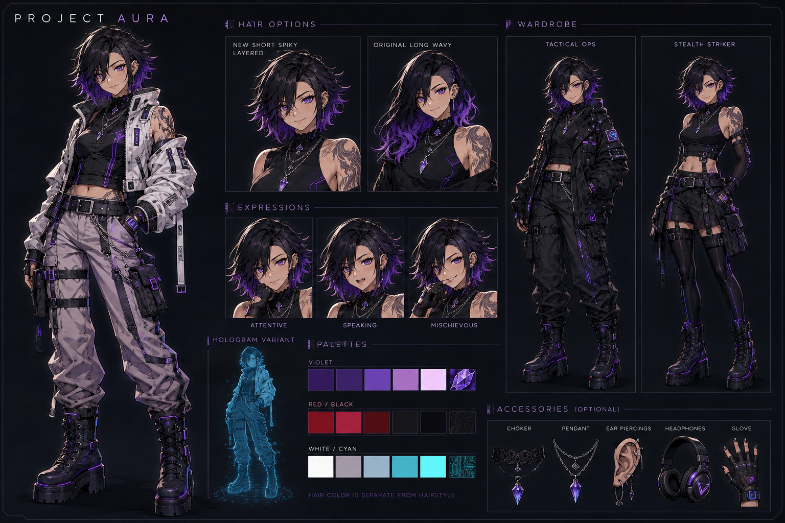

# Project Aura

An open-source experiment in persistent AI embodiment. Give an AI a visual presence, a workspace and controlled ways to participate alongside you.

Desktop companion. Digital familiar. Occasionally arrives by helicopter.



*Approved art direction; some pictured options remain planned. Working capabilities are listed below.*

[Beta downloads and demo](https://github.com/Alexflu/Project-Aura/releases) · [Creator rig standard](docs/model-standard.md) · [Contributing](CONTRIBUTING.md)

## Windows beta 0.7.0-beta.1

The beta includes a floating illustrated avatar, appearance customization, local speech and audio-driven mouth movement, equipment slots, visual spells, an optional narrated entrance/tutorial and a local MCP bridge. The entrance runs inside the program using the same renderer as the demo video.

Extract the **entire** Windows ZIP and open `ProjectAura.exe`. Keep `_internal`, `bridge`, `docs` and `examples` in place. Close older Aura versions before opening the new build. Existing preferences remain in your Windows profile. The title bar shows the running version.

- Aura starts floating with a tray icon. **Controls → Menu** opens Studio or hides/restores the tray icon. Relaunch Aura to recover Studio in the existing instance. **Menu → Quit** exits. Ctrl+Space works while Aura has focus; Shift-hover is optional.
- Choose **Entrance & guided tour** for the 64-second local performance. Sound starts off. Pause, replay, close or use **Try this feature** to open the relevant controls. Tour previews do not overwrite your saved appearance.
- Use **Appearance** for Tactical Ops / Stealth Striker, short or long hair, palettes and undo. Illustrated accessory and silhouette editing still need more artwork.
- Use **Equipment** to equip or remove a dagger, satchel, focus and a fire/ice/lightning spell. Equipment is saved. Reveal/stow is a floating prop animation, not a rigged hand grip.
- Use **Presence** for local speech or WAV playback. Selected-app level metering is experimental and not yet verified with ChatGPT Voice; it supplies loudness only.
- Use **Models** to import an [Aura Rig 1](docs/model-standard.md) PNG layer pack or try the articulated reference mannequin. Shared wave/draw motions depend on compatible joints and sockets.
- Use **Connection → Copy MCP setup** for this build and profile. `bridge/AuraMCP.exe` supplies the stdio server without a Python installation. Requests still need local approval.

Project Aura is independent of OpenAI. Direct built-in ChatGPT Voice integration is **not implemented**. The beta does not control games, design CAD parts, generate complete new body rigs, or provide photorealistic/full-body action animation. The helicopter sequence is an original stylized 2D performance stage; it does not break desktop windows or launch other apps.

## Contribute

See [Contributing](CONTRIBUTING.md), [creator item format](docs/creator-items-v1.md), [release notes and verification](docs/release-0.7.md), and [remaining work](docs/development-priorities.md). Example creator items are in `examples/creator-items/`. Donations are not configured in this build; no payment destination or campaign has been created.

| Component | Purpose |
| --- | --- |
| Project Aura | Umbrella project and community |
| AuraOS | Lifecycle and local runtime |
| AuraShell | Avatar, controls, animation and performance stage |
| AuraCore | State, permissions and request handling |
| AuraBridge | Integrations with Windows, apps and future game/hardware/CAD adapters |

## Run and develop from source

Use Python 3.11+ with Tk, then:

```powershell
python -m pip install -r requirements-desktop.txt -r requirements-mcp.txt
python run_aura.py
python -m unittest discover -s tests -v
python tools/release_smoke.py
```

Use `--data` with a temporary filename for isolated tests. Never commit real profile databases, credentials or private reference material. [MCP setup](docs/chatgpt.md) and [privacy](docs/release-0.7.md) explain the current boundaries.

To build Windows, install `requirements-build.txt` plus the desktop/MCP dependencies and run `python tools/build_windows.py`. To reproduce the video, install `requirements-media.txt`, generate narration with `python tools/create_tour_audio.py` on Windows, then run `python tools/export_demo.py`. Generated tour audio is already included for ordinary playback.

The portable build is unsigned and tested on the development Windows host; clean-machine and multi-monitor certification remain open. Source and original procedural assets use the [MIT license](LICENSE). Preserve [third-party notices](THIRD_PARTY_NOTICES.md).
